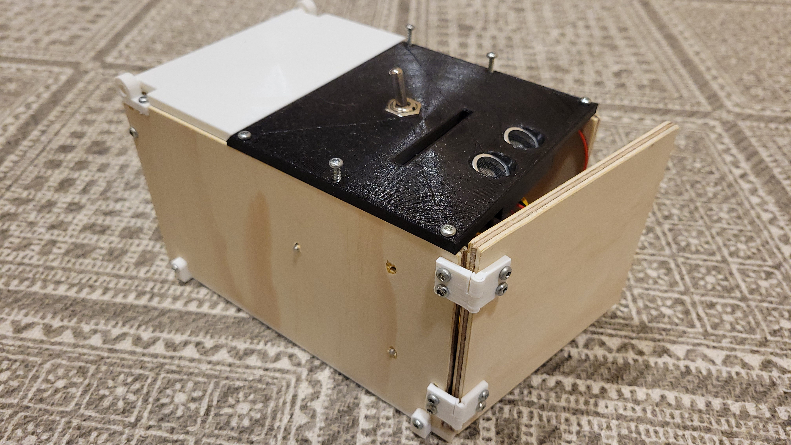
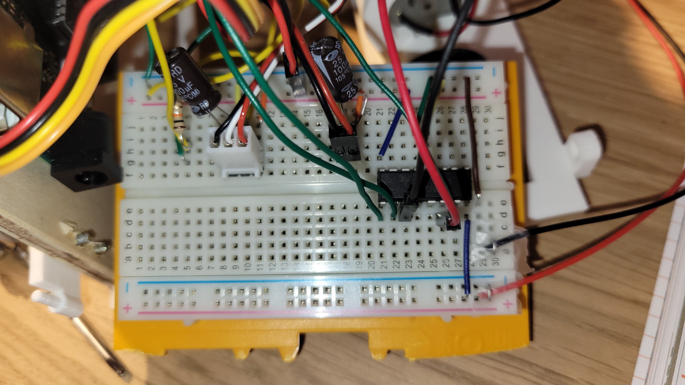
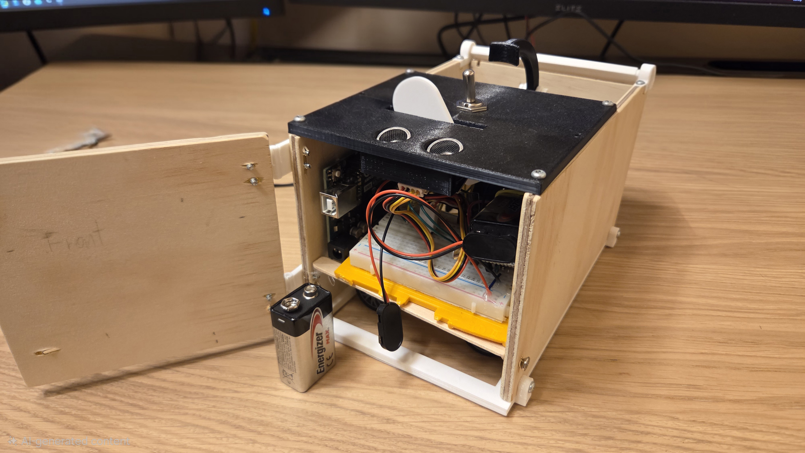

# Useless Box

An Arduino-powered useless box — a machine whose entire purpose is to undo the very action you just took. Flip its switch, and it fights back with an arm, a movable wall, and wheels to evade you.

## Hardware Components

| Component              | Purpose                                      | Pin(s)       |
|------------------------|----------------------------------------------|-------------|
| **Servo (arm)**        | Flips the toggle switch back to OFF           | 11          |
| **Servo (wall)**       | Raises a barrier to block user access         | 8           |
| **DC motors + wheels** | Moves the box away from the user              | 5, 6, 3 (enable) |
| **HC-SR04 ultrasonic** | Detects hand distance/proximity               | 9 (echo), 10 (trigger) |
| **Toggle switch**      | The target — user flips it ON; the box flips it OFF | 12 |
| **H-Bridge**           | Handle DC motors

## Code Flow

### Setup
- Initializes all servos, pins, and the distance sensor.
- Arm parks at its storage angle (70°); wall parks at its storage angle (60°).

### Main Loop (runs every ~15 ms)

1. **Sense** — Reads the toggle switch state and checks if a hand is nearby via the ultrasonic sensor.
2. **Switch reaction** — When the user flips the switch ON:
   - **70% chance:** Instant flip-back with the arm.
   - **30% chance:** A random delay (0.75–1.5 seconds) before flipping back, making it feel more organic.
3. **Escalation with persistence** — The `flickNum` counter tracks how many times the switch has been flipped. The box's response grows more aggressive:
   - **0 flips:** Arm simply reaches out.
   - **1–5 flips:** Arm + wheels activate (box moves).
   - **6+ flips:** Full arsenal — arm, wheels, and wall all engaged.
4. **Wall logic** — If a hand is detected within 15 cm while the switch is OFF, the box either raises the wall to block access or performs a quick dodge-movement with wheels (50/50 chance).
5. **Evasion** — Once the hand is gone and the switch was recently flipped, the box enters evasive mode: it drives around, reversing direction at random intervals, for ~1000 cycles (~15 seconds) to make itself harder to reach.
6. **Dodge** — A short, 15-cycle movement used as an alternative to raising the wall.

### Helper Functions

| Function            | Role                                                                                                           |
|---------------------|----------------------------------------------------------------------------------------------------------------|
| `flip(attempt)`     | Orchestrates the switch-flipping response based on how many times the switch has been flipped.                 |
| `reachArm(peek)`    | Moves the arm to the switch. Occasionally (1/3 chance) uses a "peek" angle (120°) before reaching all the way. |
| `storeArm(mode)`    | Returns the arm to its storage position. Has a "peek" mode that briefly pauses at 120° before storing.         |
| `moveWall()`        | Controls raising/lowering the barrier wall based on hand proximity.                                            |
| `move()`            | Drives the evasive maneuver sequence — alternating move/wait cycles with random direction changes.             |
| `dodge()`           | Executes a quick move-away maneuver.                                                                           |
| `distanceSensing()` | Reads the ultrasonic sensor; returns `true` if a hand or object is within range.                               |

## Key Design Decisions

- **Progressive escalation** — The box doesn't go all-out immediately. It ramps up its resistance the more persistently the user flips the switch, giving it personality.
- **Randomized timing** — Delays, movement durations, and direction changes use `random()` to make the box feel unpredictable rather than robotic.
- **Debounced hand detection** — A counter-based debounce prevents the sensor noise from triggering false evasion/wall actions.
- **Dual defense** — When a hand is near, the box chooses between raising a wall (blocking) or dodging (moving away) at random, making it harder to predict.
